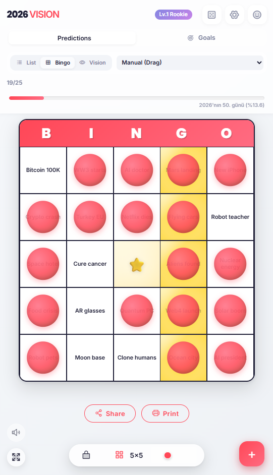
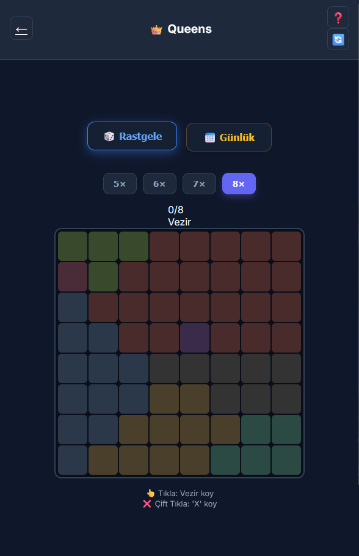
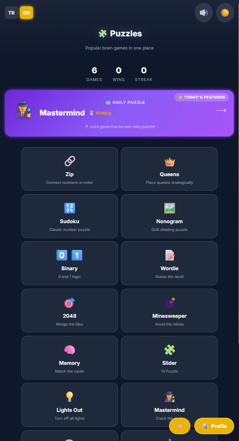

# 2026 Life Architect 🎯

> *"You can't hit a target you can't see, and you can't see a target you don't have."*

A gamified goal-tracking Progressive Web App that transforms the classic New Year's Bingo experience into a modern, interactive life planning tool.

   

<p align="center">
  
  
  
</p>

## Features

### Premium UI
- **Deep Glass** design with frosted-glass effects and layered depth
- Micro-animations on every interaction
- Three themes: Light, Dark, Cyberpunk

### Core Modules
- **Predictions Mode** — track what you think will happen in 2026
- **Goals Mode** — set actionable life goals with deadlines
- **Bingo View** — classic grid with row-completion (Bingo!) celebrations
- **Vision Board** — image-driven inspiration wall
- **List View** — sortable, drag-and-drop task management

### Gamification Engine
- **XP & Levels** — earn points for completing goals (Easy: 1XP → Impossible: 10XP)
- **31 Badges** — from "First Goal" to "God Mode" and "Perfect Week"
- **Streak System** — daily login rewards with milestone celebrations
- **Confetti Effects** — throttled & optimized for mobile performance

### i18n
- Full English and Turkish language support
- One-click language toggle from Settings
- 150+ translated strings

### Tech Stack
| Layer | Technology |
|-------|-----------|
| Core | HTML5 / CSS3 (Variables) / Vanilla JS (ES6+) |
| Storage | localStorage with obfuscation + checksum |
| PWA | Service Worker, Web App Manifest |
| Effects | [canvas-confetti](https://github.com/catdad/canvas-confetti) |
| Icons | [Phosphor Icons](https://phosphoricons.com) (Duotone) |
| Fonts | Inter (Google Fonts) |
| Build | None — zero dependencies, open `index.html` |

## Quick Start

```bash
# Clone
git clone https://github.com/batuhania/life-architect.git
cd life-architect

# Option 1: Just open
# Double-click index.html in your browser

# Option 2: Local server (recommended for PWA)
python -m http.server 8000
# → http://localhost:8000
```

## Project Structure

```
├── index.html          # App shell & all modals
├── style.css           # Design system (60KB of pure CSS)
├── script_v9.js        # App logic, i18n, gamification
├── sw.js               # Service Worker for offline support
├── manifest.json       # PWA manifest
├── icon.svg            # Vector app icon
├── icon-192x192.png    # PWA icon (192px)
└── icon-512x512.png    # PWA icon (512px)
```

## Privacy

All data stays in your browser's `localStorage` — **nothing is sent to any server**. The app works fully offline after first load. Backup/restore uses encrypted JSON export.

---

*Built by [batuhania](https://github.com/batuhania)*


